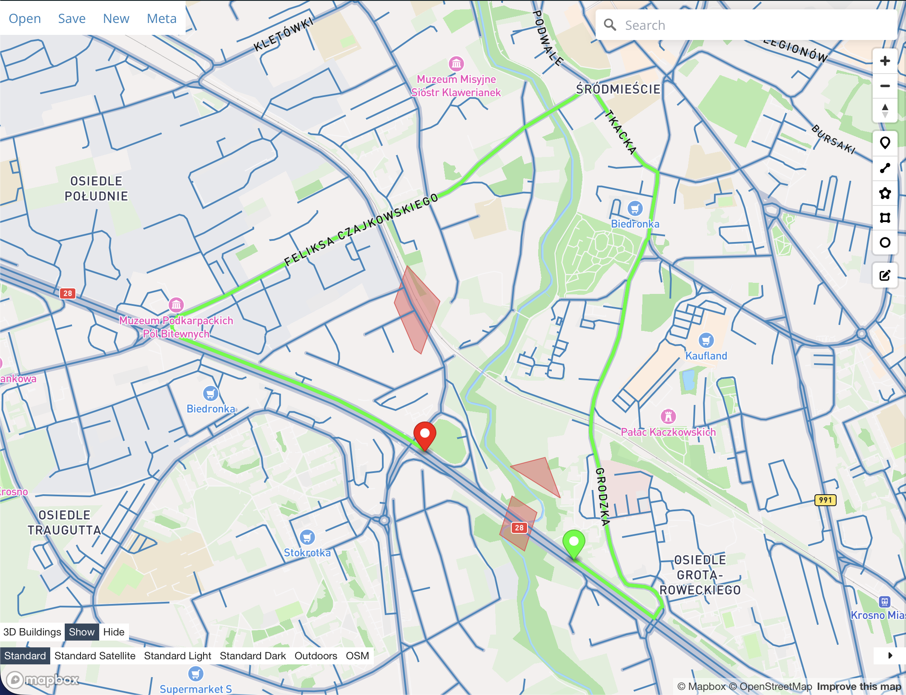

# Geo Escape Route

A Java-based application for calculating optimal escape routes using geospatial data.

## Requirements

- **OpenJDK 17** (included with the project as a toolchain)
- **Gradle 9.x** (included with the project as a wrapper)
- **Git** (for cloning the repository)

## Setup Instructions

1. **Clone the repository:**
    ```sh
    git clone https://github.com/y3v4d/geo-escape-route.git
    cd geo-escape-route
    ```

2. **Build the project:**
    ```sh
    ./gradlew build
    ```

3. **Run the application:**
    ```sh
    ./gradlew run
    ```

## Usage

The application starts a local server at `http://localhost:3001`. You can access the API endpoints to calculate escape routes based on geospatial data.

### Editing Map and Flood Data

- Map data is located in `app/src/main/resources/roads.geojson`.
- Flood zone data is located in `app/src/main/resources/flood_zones.geojson`.

### API Endpoints

- `GET /api/evac?start={lat,lon}&end={lat,lon}[&full]`
    - Calculates the escape route between the specified start and end points.
    - Parameters:
        - `start`: Latitude and longitude of the starting point (format: `lat,lon`).
        - `end`: Latitude and longitude of the ending point (format: `lat,lon`).
        - `full` (optional): If present, includes roads and flood zones in the response.
    - Response: GeoJSON FeatureCollection representing the escape route and optionally the full visualization.
    - Example:
      ```
      http://localhost:3001/api/evac?start=21.7643873,49.6833371&end=21.7602742,49.6853010&full
      ```

### Visualization

You can visualize the GeoJSON output using tools like [geojson.io](https://geojson.io/) by copying and pasting the response data.

## Building a Runnable JAR

To create a runnable JAR file, use the following command:

```sh
./gradlew shadowJar
```

The JAR file will be located in `app/build/libs/geo-escape-route-1.0.0.jar`. You can run it using:

```sh
java -jar app/build/libs/geo-escape-route-1.0.0.jar
```

## Additional Notes

- Ensure Java is added to your system's PATH and JAVA_HOME is set correctly.

## Screenshots



## TODO

- [ ] Add unit tests for core functionalities.
- [ ] Implement dynamic GeoJSON route loading from OpenStreetMap.
- [ ] Implement GeoTIFF import for flood zones.
- [ ] Implement dynamic GeoTIFF loading from Sentinel Hub.
- [ ] Implement better error handling and logging.
- [ ] Implement GeoJSON validation.